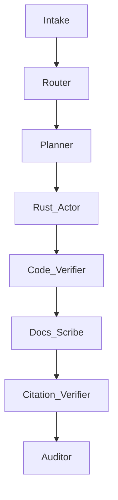

# Introduction {#sec-intro}

Large language models (LLMs) have shifted from single‑answer assistants toward agentic systems that plan, act with tools, verify, and iterate. As the number of agents and tools grows, systems require explicit state contracts, verifiable outputs, and predictable hand‑offs. In practice, ad‑hoc scripting creates fragility and debt. GRAPH‑KG addresses this gap by centring a knowledge graph (KG) as the authoritative state model, defining a prompt‑aware orchestration spine, and enforcing evidence and verification, drawing on established bodies of practice such as SWEBOK 4.0 and APA 7th [@swebok4.0; @apa2020manual].

# Background and related work {#sec-background}

GRAPH‑KG synthesises several strands:

- Linear prompt frameworks (e.g., C.R.A.F.T.) that clarify scope and audience.
- ReAct‑style interleaving of reasoning and acting with tools [@yao2023react].
- Breadth‑first deliberation such as Tree‑of‑Thought with selection [@yao2023tot].
- Quality‑boosting strategies like Self‑Consistency and Reflexion [@wang2023selfconsistency; @shinn2023reflexion].
- Guardrailed outputs via schemas and validators; reproducible publishing via Quarto; platform‑first engineering in Rust; and MCP‑based tool integration [@quartodocs; @mcp-spec].

GRAPH‑KG reframes these into an architecture where prompts, tools, and state cooperate under explicit contracts rather than informal conventions.

# Design goals {#sec-goals}

- Verifiability: Prefer external checks (tests, citations, schema and KG constraints) over free‑form self‑reflection.
- Composability: Prompts are small, typed components with explicit inputs/outputs and hand‑offs.
- Observability: Every agent action is loggable and attributable with provenance.
- Platform first: Typed, maintainable components; avoid tactical scripts unless explicitly authorised.
- Governance: git/GitHub PRs, reviewable diffs, versioned decisions.
- Portability: Work across GPT‑5‑class models, Claude Code, Gemini CLI, and CODEX CLI via MCP tools.
- Developer experience: Quarto for documents; NDJSON for line‑granular diffs; Rust loaders and CLIs [@ndjson; @surrealdbdocs].

# The GRAPH‑KG framework {#sec-framework}

GRAPH‑KG comprises five orchestration pillars plus a KG contract and two cross‑cutting policies.

## Goals (bounded objectives)

- Primary goal: A single measurable objective per agent/prompt.
- Capability boundaries: CAN/CANNOT lists; unsafe actions explicitly enumerated.
- Success metrics: Concrete external outcomes (tests pass, citations resolve, KG constraints satisfied).

## Resources (context management)

- Models and limits: Select model and reasoning effort; set token and tool budgets.
- Context strategy: Retrieval sources and cache policy; offline‑only modes.
- Tools: Allowed MCP tools/CLIs with versions and preconditions.

## Actions (graph‑based workflow)

- Process graph: Non‑linear plan with conditional edges; start/end nodes.
- Recovery: Error handling and rollback paths.
- Early‑stop criteria: When to stop searching and act; when to escalate.

## Protocols (integration standards)

- Input/output schemas: JSON/NDJSON shapes, Quarto section schemas for docs.
- Event emissions: Which events trigger downstream agents; how state updates the KG.
- Safety gates: Dual confirmation for destructive or irreversible operations.

## Handoffs (inter‑agent communication)

- Upstream/downstream contracts: What is required and what is produced.
- Shared state: What gets persisted to the KG and when.
- Escalation: Human‑in‑the‑loop triggers (policy violations, conflicts, resource constraints, quality‑gate failures).

## Knowledge‑Graph Contract (KG‑C) {#sec-kgc}

- Single source of truth: The KG plus its schemas and constraints.
- Decision DD‑001: NDJSON as the interim context storage format prior to SurrealDB ingestion [@ndjson; @surrealdbdocs].
- Provenance: Each entity and relation carries {source, timestamp, agent, tool, evidence_refs}.
- Integrity: Identity/dedup policy; SHACL‑style domain/range, cardinality, and required property rules; fail‑closed on violations.
- Transactions: Atomic writes, read‑your‑writes, conflict resolution policy.

::: callout-note
#### Decision DD‑001 (Knowledge Graph Text Format)

- Decision: Use NDJSON for interim KG context storage before SurrealDB ingestion.
- Rationale: Line‑granular diffs; native JSON compatibility for LLMs; straightforward loaders.
- Consequences: One JSON object per line with provenance; SurrealQL mapping supported.

:::

## Cross‑cutting policies

- ReAct‑style Tool Policy: Plan before first tool call; act → observe → update; cache context; avoid redundant calls; enforce budgets; gate unsafe actions [@yao2023react].
- Chain‑of‑Verification: Verify facts (citations), code (tests/linters), docs (schema checks, APA 7th), KG writes (constraint checks). Mark unresolved items TO‑VERIFY and proceed only when safe.

# How prompts fit together: the prompt stack {#sec-stack}

Each role is a prompt with a narrow responsibility, typed I/O, and a place in the orchestration graph.

- Intake prompt: Asks minimal questions; resolves requirements and constraints; initialises Field Variables.
- Router prompt: Classifies intent and selects the agent subgraph; writes routing decisions to the KG.
- Planner prompt: Produces the process graph and tool budget; sets stop conditions and safety gates.
- Actor prompts (per agent): Execute domain tasks under the Tool Policy and KG‑C.
- Verifier prompts: Run tests, validate schemas, check citations, enforce KG constraints; score candidates for Best‑of‑N.
- Scribe prompt: Generates Quarto documents with APA 7th compliance.
- Auditor prompt: Performs contradiction scans, policy checks, and writes an audit log entry with provenance.

### Example orchestration graph



# Knowledge graph integration and DD‑001 {#sec-dd001}

### NDJSON entity (one object per line)

```json
{"id":"agent:router","type":"Agent","props":{"name":"Router","capabilities":["intent_routing"]},"provenance":{"source":"system","captured_at":"2025-08-09T12:00:00Z","agent_id":"system","tool":"init","evidence_refs":[]}}
```

### NDJSON relation

```json
{"from":"agent:router","to":"prompt:router_v1","label":"IMPLEMENTS","props":{},"provenance":{"source":"system","captured_at":"2025-08-09T12:00:01Z","agent_id":"system","tool":"init","evidence_refs":[]}}
```

### SurrealQL mapping

```sql
CREATE agent:router SET name = "Router", capabilities = ["intent_routing"];
```

Integrity highlights:

- Identity policy: Agents keyed by stable ids `agent:<slug>`; prompts versioned (semantic); decisions keyed `DD-<NNN>`.
- Constraints: Every Relation requires `from`, `to`, `label`; every Agent must `IMPLEMENT` at least one Prompt; every Prompt belongs to exactly one Agent.

# Implementation guidance (platform‑first) {#sec-impl}

- Languages and tooling: Prefer Rust for loaders/CLIs, services, and MCP tools; TypeScript acceptable for web front‑ends; avoid Python and shell scripts unless explicitly authorised, with rationale.
- Documents: Quarto for websites, papers, and runbooks; APA 7th citations; deterministic builds [@quartodocs; @apa2020manual].
- MCP and CLIs: Wrap CODEX CLI, Claude Code, and Gemini CLI as MCP tools with typed schemas; define preconditions and safety gates in tool metadata [@mcp-spec].
- Deployment and ops: Package services for Fly.io; define health checks, scaling, and rollback; capture deploy events in the KG [@flyiodocs].
- Version control: Keep all NDJSON, Quarto sources, and Rust crates under git/GitHub; require PRs and checks; use line‑granular reviews [@githubdocs].

# Quality gates and monitoring {#sec-quality}

- Contradiction scan: Detect and resolve conflicting instructions across prompts and policies.
- Evidence check: Citations present where required; APA 7th fields parsable; DOIs/URLs validated where available [@apa2020manual].
- Schema compliance: JSON/NDJSON structure; Quarto section presence; KG constraints.
- Tool budgets: Respect call limits and early‑stop criteria.
- Metrics: Agent completion rate; inter‑agent latency; human intervention frequency; quality‑gate failure rate; deployment success rate.
- Dashboards: Real‑time agent status; system health; performance; error tracking.

# Worked example {#sec-example}

Scenario: “Generate a research‑grade Quarto paper on Rust zero‑copy parsing with a benchmarked crate and a Fly.io deployment runbook.”

- Intake collects: goal, deliverables (crate diff, benches, Quarto paper, runbook), constraints (offline‑only = false), tools (MCP set), evidence policy (citations required), KG contract (namespaces, identity rules).
- Router selects subgraph: {Planner → Rust Actor → Verifier(Code) → Scribe(Docs) → Verifier(Citations) → Auditor}.
- Planner assigns budgets: reasoning = high for design; medium for code; `tool_budget_max = 8`; unsafe deploy requires dual confirmation.
- Actor (Rust) produces crate code, tests, benches; writes artefact nodes to KG; emits `code_ready`.
- Verifier (Code) runs `cargo test/bench`; writes results to KG; failure triggers recovery.
- Scribe generates Quarto manuscript sections with APA 7th references; writes `draft_ready`.
- Verifier (Citations) checks reference fields; unresolved become TO‑VERIFY.
- Auditor runs contradiction and policy checks; the KG records provenance for each artefact.

# Comparative analysis: GRAPH‑KG vs C.R.A.F.T. {#sec-compare}

- Strengths: GRAPH‑KG formalises state, hand‑offs, and verification; aligns with MCP and typed CLIs; scales to multi‑agent flows; supports monitoring.
- Trade‑offs: More moving parts and upfront modelling; requires KG discipline and schema evolution; needs verification tooling investment.
- When to use C.R.A.F.T.: Single‑agent tasks with minimal tooling and no persistent state.
- When to use GRAPH‑KG: Platform contexts with multiple agents, tools, and long‑running stateful workflows.

# Governance, risk, and safety {#sec-governance}

- Unsafe actions: Deployment, database writes, file deletion require dual confirmation and a dry‑run artefact.
- Privacy/licensing: Redact PII in logs; include licence metadata for generated code and documents.
- Incident response: Capture exceptions and rollbacks as KG events; maintain a post‑mortem template in Quarto.

# Limitations and future work {#sec-limitations}

- KG quality dependency: Poor schemas or lax provenance undermine integrity.
- Tool reliability: MCP wrappers and CLIs must be robust and versioned.
- Cost/latency: Best‑of‑N and verification add overhead—mitigated by budgets and early‑stop rules.
- Future: Learned routers/verifiers, adaptive budgets, and stronger formal constraints (e.g., SHACL profiles) baked into prompts.

# Conclusion {#sec-conclusion}

GRAPH‑KG reframes prompt engineering as platform architecture. By insisting on a knowledge‑graph contract, typed tool policies, and verifiable outputs, it delivers reliability and governance suitable for professional software, scholarship, and operations. It complements linear templates such as C.R.A.F.T. but scales further by making prompts, agents, and state first‑class, observable citizens.

# Appendices {#sec-appendix}

## Appendix A: Minimal schemas (illustrative)

Agent (NDJSON object)

```json
{"id":"agent:router","type":"Agent","props":{"name":"Router","capabilities":["intent_routing"]},"provenance":{"source":"system","captured_at":"2025-08-09T12:00:00Z","agent_id":"system","tool":"init","evidence_refs":[]}}
```

Prompt (NDJSON object)

```json
{"id":"prompt:router_v1","type":"Prompt","props":{"role":"Router","version":"1.0.0","inputs_schema_ref":"schema:intent","outputs_schema_ref":"schema:routing"},"provenance":{"source":"system","captured_at":"2025-08-09T12:00:02Z","agent_id":"system","tool":"init","evidence_refs":[]}}
```

Handoff relation (NDJSON object)

```json
{"from":"prompt:router_v1","to":"prompt:planner_v1","label":"HANDOFFS_TO","props":{"trigger":"routing_decision"},"provenance":{"source":"system","captured_at":"2025-08-09T12:00:03Z","agent_id":"system","tool":"init","evidence_refs":[]}}
```

## Appendix B: Orchestration graph (text)

Nodes: Intake, Router, Planner, Rust_Actor, Docs_Scribe, Code_Verifier, Citation_Verifier, Auditor

Edges:
- Intake → Router [trigger: intake_complete]
- Router → Planner [trigger: route:engineering_research]
- Planner → Rust_Actor [trigger: plan_ready]
- Rust_Actor → Code_Verifier [trigger: code_ready]
- Code_Verifier → Docs_Scribe [trigger: tests_passed]
- Docs_Scribe → Citation_Verifier [trigger: draft_ready]
- Citation_Verifier → Auditor [trigger: citations_verified]
- Auditor → END [trigger: quality_gates_passed]

## Appendix C: Prompt role skeletons (concise)

Intake prompt
- Inputs: free‑text brief.
- Outputs: field_variables, assumptions, open_questions.
- Stop when: max questions asked; unresolved items marked TO‑VERIFY.

Planner prompt
- Inputs: field_variables.
- Outputs: process_graph, tool_budgets, stop_conditions.

Actor prompt (Rust)
- Preconditions: plan_ready; tool access allowed.
- Procedure: implement features; write code and tests; record artefacts to KG.
- Postconditions: tests compile; benches run; artefacts persisted.

Verifier prompt (Code)
- Procedure: `cargo test/bench`; record results; gate progression.

Scribe prompt (Quarto)
- Procedure: generate manuscript sections; enforce APA 7th; produce reproducible build.

Auditor prompt
- Procedure: contradiction scan; evidence/APA checks; tool budget adherence; write audit log.
